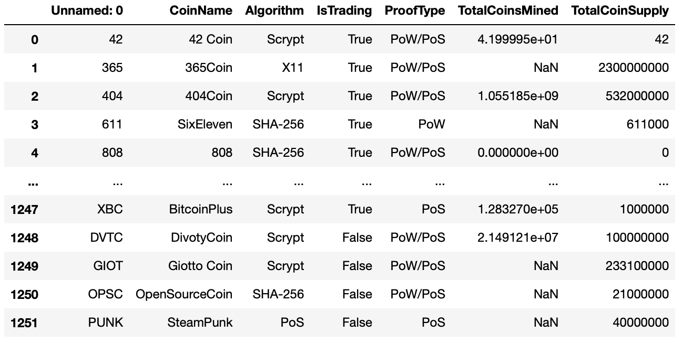
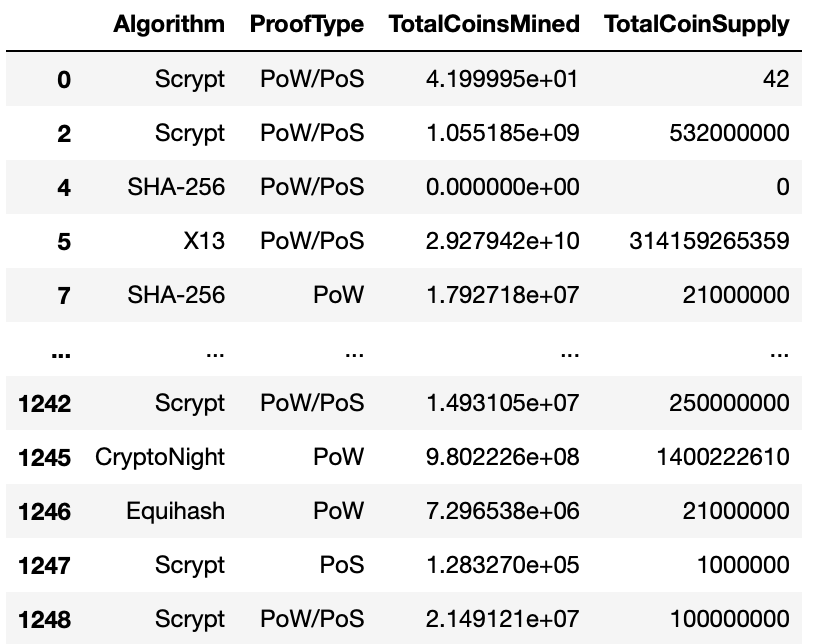
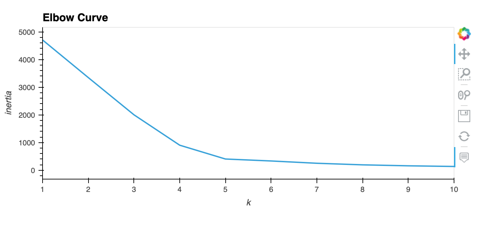
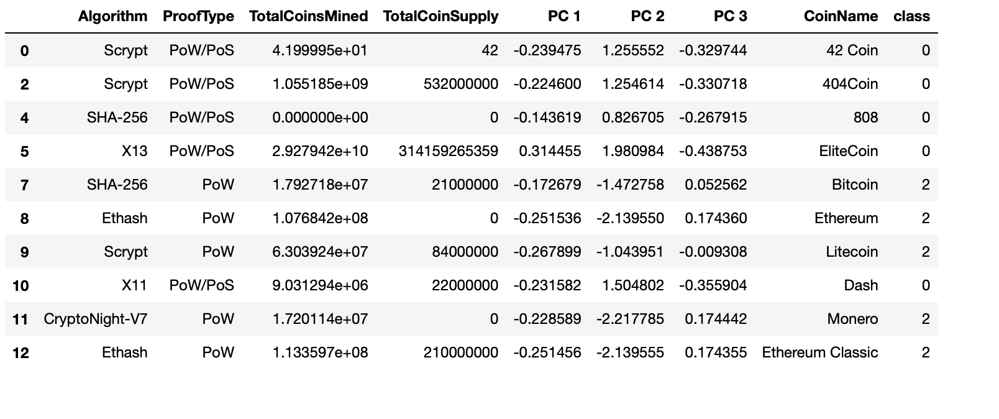
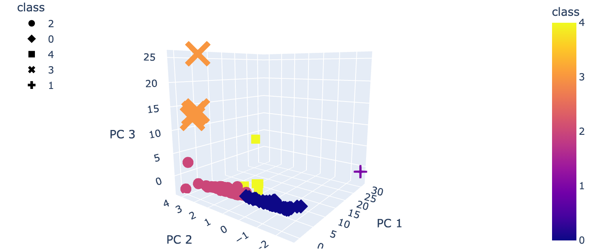
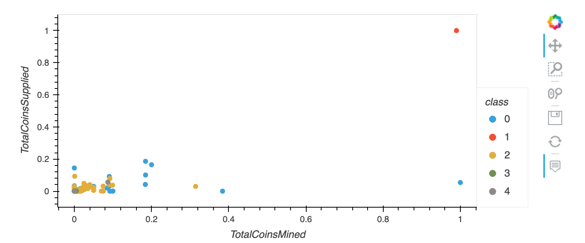
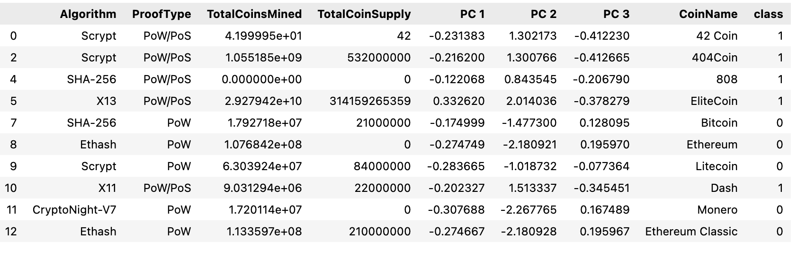

# Cryptocurrency Market

 

Martha is a senior manager and an important clients. Accountability Accounting, a prominent investment bank, is interested in offering a new cryptocurrency investment portfolio for its customers.The complexity of cryptocurrencies is overwhelming for them. So, they’ve asked me to create a report that includes what cryptocurrencies are on the trading market and how they could be grouped to create a classification system for this new investment.

Data on hand is not in its best state, so it has to be processed or cleaned up to work with the machine learning models. Martha doesn't know what she is looking for or what the output will be, so it is ideal to use unsupervised learning with clustering algorithm. 
 
## Inital data view before any processing.

## Null values dropped and 'IsTrading' column removed.

 

 

## Elbow Curve diagram displayed below which shows the elbow point breaks. It lies on 5.

 

## Below is a snapshot of tradable crypto currencies table.

 

 

 

 

